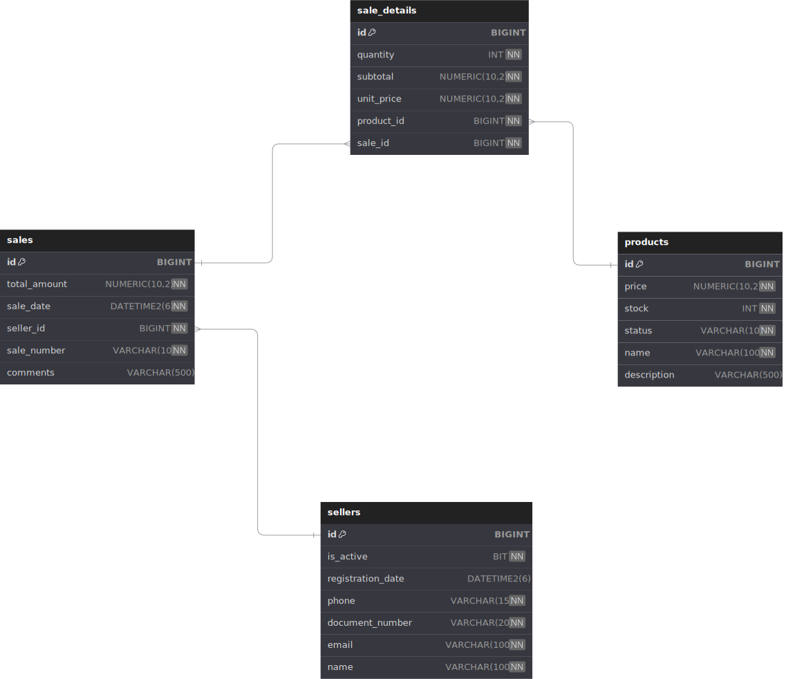

# Manual de Instalación y Ejecución

Este documento proporciona las instrucciones detalladas para configurar y ejecutar la aplicación.

## Requisitos Previos

Antes de comenzar, asegúrate de tener instalado:

- Java SDK 21
- Docker Desktop
- IDE (preferiblemente IntelliJ IDEA)
- Git

## Pasos de Instalación

### 1. Clonar el Repositorio

```bash
git clone <URL_DEL_REPOSITORIO>
cd tecser-backend
```

### 2. Configuración de la Base de Datos

La aplicación utiliza SQL Server como base de datos. Para inicializarla:

1. Navega a la carpeta del backend:
```bash
cd backend
```

2. Inicia el contenedor de SQL Server usando Docker Compose:
```bash
docker-compose up -d
```

Esto iniciará un contenedor con SQL Server con las siguientes configuraciones:
- Puerto: 1433
- Usuario: sa
- Contraseña: SqlServer2023!
- Base de datos: store-db

3. Configuración del Trigger para el Estado de Productos:
   Después de que las tablas se hayan creado automáticamente, debes conectarte a la base de datos y ejecutar el siguiente trigger:

```sql
CREATE TRIGGER trg_UpdateProductStatus
ON products
AFTER INSERT, UPDATE
AS
BEGIN
    -- Actualizar el estado a 'AGOTADO' cuando el stock sea 0
    UPDATE p
    SET p.status = 'AGOTADO'
    FROM products p
    INNER JOIN inserted i ON p.id = i.id
    WHERE i.stock = 0;

    -- Opcional: Cambiar el estado a 'ACTIVO' si el stock vuelve a ser mayor que 0
    UPDATE p
    SET p.status = 'ACTIVO'
    FROM products p
    INNER JOIN inserted i ON p.id = i.id
    WHERE i.stock > 0 AND p.status = 'AGOTADO';
END;
```

Este trigger se encarga de:
- Actualizar automáticamente el estado de los productos a 'AGOTADO' cuando su stock llega a 0
- Cambiar el estado a 'ACTIVO' cuando el stock vuelve a ser mayor que 0

### 3. Configuración del Proyecto

El proyecto utiliza Spring Boot y está configurado con los siguientes perfiles:

- **dev**: Para desarrollo local (por defecto)
- **prod**: Para producción

La configuración se encuentra en `src/main/resources/application.yml`

### 4. Ejecutar la Aplicación

#### Usando IntelliJ IDEA:

1. Abre el proyecto en IntelliJ IDEA
2. Espera a que se sincronicen las dependencias de Gradle
3. Ejecuta la aplicación desde la clase principal con el botón ▶️

#### Usando la línea de comandos:

```bash
./gradlew bootRun
```

### 5. Verificar la Instalación

Una vez iniciada la aplicación:

1. La API estará disponible en: `http://localhost:8080/api`
2. La base de datos estará accesible en: `localhost:1433`

## Estructura del Proyecto

La aplicación utiliza:
- Spring Boot
- Spring Data JPA
- Spring MVC
- Jakarta EE
- Lombok
- SQL Server

## Modelo de Datos

### Diagrama Relacional de la Base de Datos
Este diagrama muestra la estructura y relaciones de las tablas en la base de datos:



## Endpoints de la API

La API está configurada con el contexto base `/api`

## Solución de Problemas Comunes

1. **Error de conexión a la base de datos**
   - Verificar que el contenedor Docker esté en ejecución
   - Comprobar las credenciales en application.yml
   - Verificar que el puerto 1433 esté disponible

2. **Error al iniciar la aplicación**
   - Verificar que Java 21 esté instalado y configurado correctamente
   - Comprobar que todas las dependencias se hayan descargado

## Notas Adicionales

- La aplicación está configurada para crear/actualizar automáticamente las tablas de la base de datos en el perfil de desarrollo (dev)
- Los logs SQL están habilitados en desarrollo para facilitar la depuración
- El proyecto utiliza Gradle como gestor de dependencias

## Referencias

Para más información, consulta:
- [Documentación oficial de Spring Boot](https://docs.spring.io/spring-boot/docs/current/reference/html/)
- [Documentación de Spring Data JPA](https://docs.spring.io/spring-data/jpa/docs/current/reference/html/)